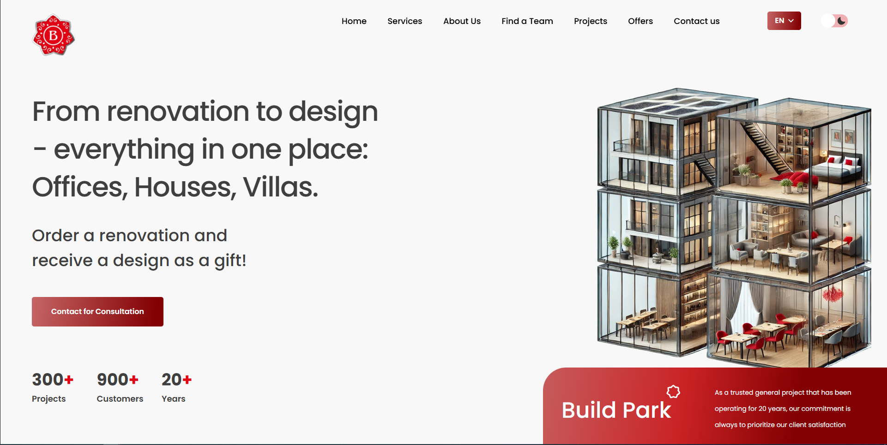
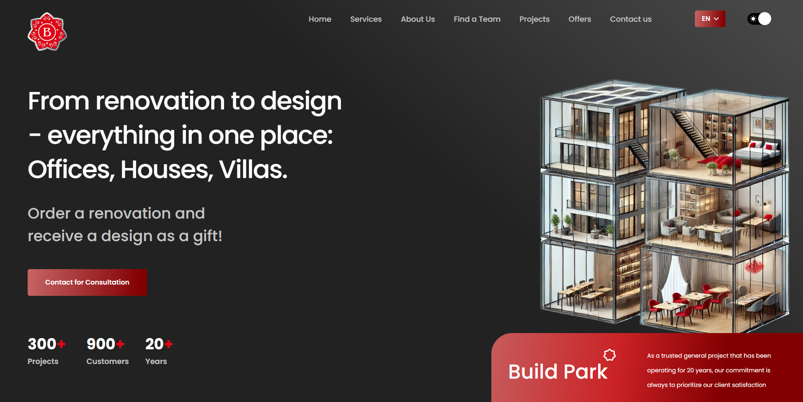
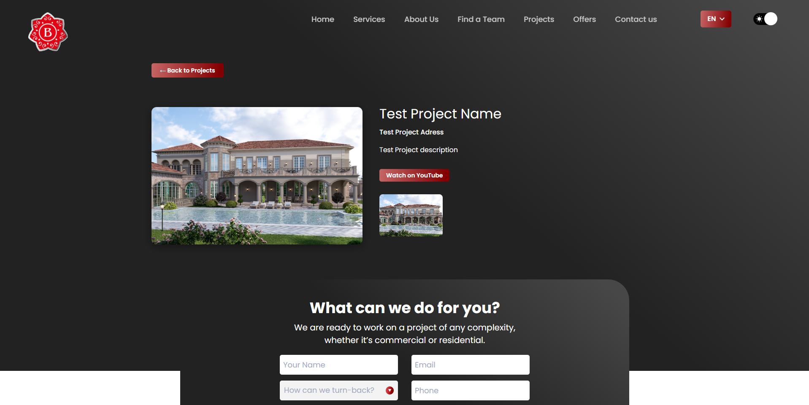
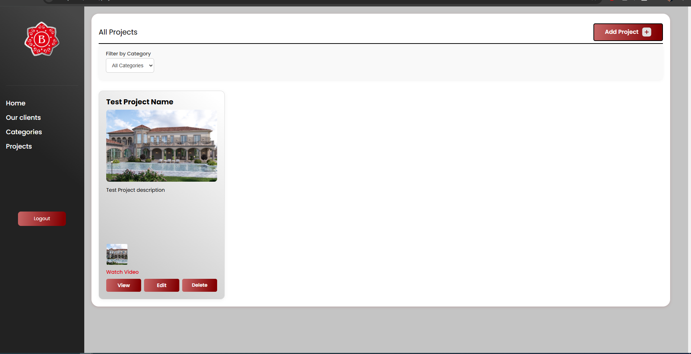
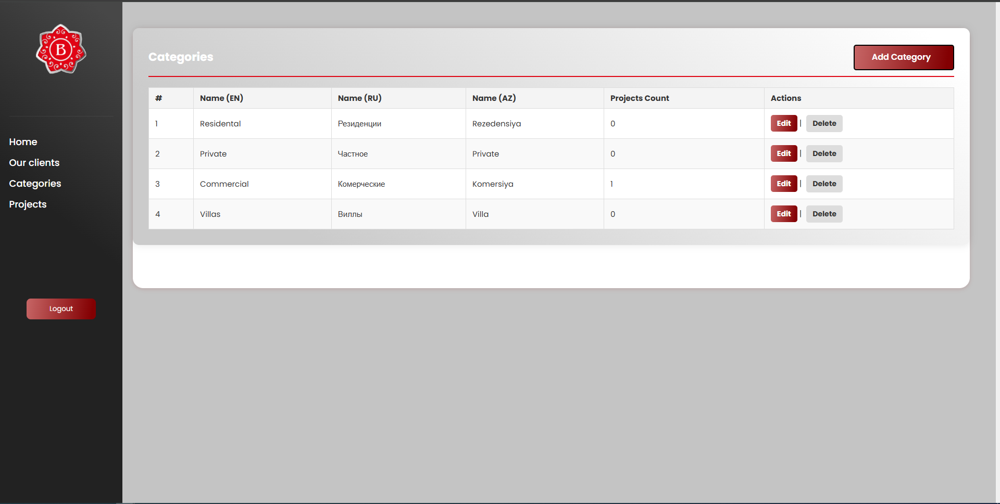

# 🏗️ BuildPark.az — Construction & Architecture Company Website

🔗 [Visit Live Site](https://buildpark.az/)  
🎨 UI design by [Lali Bagrationi](https://www.behance.net/ebb49210) · Built by [Daker.site](https://daker.site)

**BuildPark.az** is a modern Laravel-based website for a construction and architecture company specializing in building houses, apartments, offices, and providing complete design services for residential and commercial spaces.

The platform showcases the company's portfolio, enables easy management of projects and client lists via an admin panel, and features a **light/dark theme switcher** for an enhanced user experience.

---

## ✨ Key Features

- 🏢 **Portfolio Management**  
  Display completed projects with images, descriptions, and categories (architecture, design, construction).

- 🎨 **Light/Dark Theme Toggle**  
  Visitors can instantly switch between light and dark modes for a personalized viewing experience.

- 🧰 **Admin Dashboard**  
  Admins can:
  - Add, edit, and delete portfolio projects
  - Manage "Our Clients" section
  - Upload project images
  - Update descriptions and project details

- 📤 **Social Media Sharing**  
  Visitors can share projects directly on Facebook, Twitter, WhatsApp, Telegram, and other platforms.

- 📱 **Responsive Design**  
  Optimized for viewing on desktop, tablet, and mobile devices.

---

## ⚙️ Tech Stack

| Layer           | Technology            |
|----------------|------------------------|
| **Backend**     | Laravel (PHP)          |
| **Frontend**    | Blade templates + JavaScript |
| **Database**    | MySQL                  |
| **Styling**     | Tailwind CSS           |
| **Theme**       | Light/Dark mode toggle with JS |
| **Routing**     | Laravel routes/web.php |
| **SEO**         | Metadata, social sharing optimization |

---

## 📸 Screenshots

### 🏠 Home Page — Light Mode
Clean and modern layout showcasing featured projects and services.

---

### 🌙 Home Page — Dark Mode
Dark theme for better night-time browsing experience.

---

### 🏗️ Project Detail Page
Full project description with gallery, category, and direct social media sharing buttons.

---

### 🛠️ Admin Panel — Project Editor
Admin interface for adding, editing, and removing portfolio items.

---

### 👥 Our Clients — Admin Panel
Easily manage and update projects' categories.

